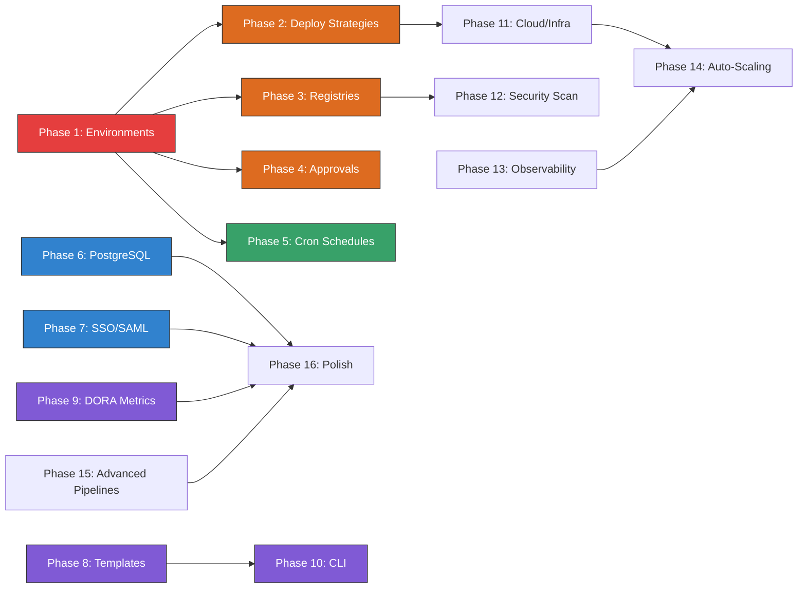

# FlowForge — Incremental Implementation Plan

> Phased implementation plan for all missing features, ordered by dependency and priority.
> Each phase is broken into atomic tasks suitable for individual implementation sessions.

---

## Phase 1: Environments & Deployment Foundation

The single most critical gap — transforms FlowForge from a CI tool into a deployment manager.

### 1.1 Environment Model & Database

- [ ] Create migration `016_create_environments.sql` with schema:
  - `id`, `project_id`, `name` (dev/staging/production/custom), `slug`, `url`, `description`
  - `is_production` flag, `auto_deploy_branch`, `required_approvers` (JSON array)
  - `protection_rules` (JSON: require_approval, allowed_deployers, deploy_window)
  - `deploy_freeze` boolean, `lock_owner_id`, `lock_reason`, `locked_at`
  - `current_deployment_id`, `created_at`, `updated_at`
- [ ] Create migration `017_create_deployments.sql`:
  - `id`, `environment_id`, `pipeline_run_id`, `version`, `status` (pending/deploying/live/failed/rolled_back)
  - `commit_sha`, `image_tag`, `deployed_by`, `started_at`, `finished_at`
  - `health_check_status`, `rollback_from_id`
  - `metadata` (JSON: replicas, resources, custom fields)
- [ ] Create migration `018_create_env_overrides.sql`:
  - Environment-specific secret and env var overrides
  - `id`, `environment_id`, `key`, `value_enc`, `is_secret`, `created_at`
- [ ] Add Go models: [`Environment`](backend/internal/models/environment.go), [`Deployment`](backend/internal/models/deployment.go), `EnvOverride`
- [ ] Add repository queries: `EnvironmentRepo`, `DeploymentRepo`

### 1.2 Environment API Endpoints

- [ ] `GET /api/v1/projects/:id/environments` — list environments for project
- [ ] `POST /api/v1/projects/:id/environments` — create environment
- [ ] `PUT /api/v1/projects/:id/environments/:eid` — update environment
- [ ] `DELETE /api/v1/projects/:id/environments/:eid` — delete environment
- [ ] `POST /api/v1/projects/:id/environments/:eid/lock` — lock environment
- [ ] `POST /api/v1/projects/:id/environments/:eid/unlock` — unlock environment
- [ ] `GET /api/v1/projects/:id/environments/:eid/deployments` — deployment history
- [ ] `POST /api/v1/projects/:id/environments/:eid/deploy` — trigger deployment
- [ ] `POST /api/v1/projects/:id/environments/:eid/rollback` — rollback to previous
- [ ] `POST /api/v1/projects/:id/environments/:eid/promote` — promote from another env
- [ ] `GET /api/v1/projects/:id/environments/:eid/overrides` — env-specific vars/secrets
- [ ] `PUT /api/v1/projects/:id/environments/:eid/overrides` — bulk save overrides

### 1.3 Environment Frontend

- [ ] Add `Environments` tab to `ProjectDetailPage` with environment cards
- [ ] Environment creation/edit modal with protection rules form
- [ ] Deployment history table per environment
- [ ] Environment status badges (live, deploying, locked, frozen)
- [ ] Deploy action button with confirmation dialog
- [ ] Rollback action with version picker
- [ ] Promote dialog (source env → target env)
- [ ] Lock/unlock controls
- [ ] Environment-specific variable/secret editor
- [ ] Add environments to dashboard overview (global deploy status)

### 1.4 Engine Integration

- [ ] Modify pipeline trigger to accept `target_environment` parameter
- [ ] Inject environment-specific variables and secrets into pipeline execution
- [ ] Create deployment record when pipeline completes successfully
- [ ] Update environment's `current_deployment_id` on successful deploy
- [ ] Implement deploy freeze check before allowing deployments
- [ ] Implement environment lock check before allowing deployments

---

## Phase 2: Deployment Strategies

### 2.1 Strategy Framework

- [ ] Create `DeploymentStrategy` interface in `backend/internal/deploy/strategy.go`:
  - `Plan()` — compute deployment steps
  - `Execute()` — perform the deployment
  - `Verify()` — run health checks
  - `Rollback()` — revert on failure
- [ ] Implement `RollingStrategy` — incremental pod replacement
- [ ] Implement `BlueGreenStrategy` — switch traffic between two sets
- [ ] Implement `CanaryStrategy` — gradual traffic shift with configurable percentages
- [ ] Implement `RecreateStrategy` — simple stop-and-start (default)
- [ ] Add `strategy` field to environment model (rolling/blue-green/canary/recreate)
- [ ] Add strategy configuration fields (max_surge, max_unavailable, canary_weight, etc.)

### 2.2 Health Check System

- [ ] Create `HealthChecker` in `backend/internal/deploy/health.go`:
  - HTTP health check (configurable URL, expected status, timeout)
  - TCP port check
  - Custom command check
- [ ] Add health check configuration to environment model
- [ ] Implement automatic rollback on health check failure
- [ ] Add health check results to deployment record

### 2.3 Deployment Gates

- [ ] Pre-deploy gates: approval required, tests passed, no deploy freeze
- [ ] Post-deploy gates: health check passed, smoke tests, monitoring alerts clear
- [ ] Gate timeout configuration
- [ ] Gate bypass for emergency deployments (with audit trail)

### 2.4 Strategy Frontend

- [ ] Strategy selector in environment configuration
- [ ] Strategy-specific settings form (canary weights, health check URL, etc.)
- [ ] Deployment progress visualization (rolling progress bar, canary traffic split)
- [ ] Real-time health check status display

---

## Phase 3: Container Registry Management

### 3.1 Registry Backend

- [ ] Create migration `019_create_registries.sql`:
  - `id`, `project_id`, `name`, `type` (dockerhub/ecr/gcr/acr/harbor/ghcr)
  - `url`, `credentials_enc` (encrypted), `is_default`
  - `created_at`, `updated_at`
- [ ] Add `Registry` model and repository
- [ ] Registry credential management (encrypted storage like secrets)
- [ ] Docker Hub API client
- [ ] ECR API client (AWS SDK)
- [ ] GCR API client
- [ ] GHCR API client

### 3.2 Registry API

- [ ] CRUD endpoints for registries under projects
- [ ] `GET /api/v1/projects/:id/registries/:rid/images` — list images
- [ ] `GET /api/v1/projects/:id/registries/:rid/images/:name/tags` — list tags
- [ ] Image tag management (delete, promote)

### 3.3 Registry Frontend

- [ ] Registry management UI in project settings
- [ ] Image browser with tag list and size info
- [ ] Credential setup wizard per registry type

### 3.4 Pipeline Integration

- [ ] Auto-inject registry credentials into Docker build/push steps
- [ ] Auto-tag images based on configurable policy (SHA, branch, semver)
- [ ] Image reference resolution in deployment steps

---

## Phase 4: Approval & Governance

### 4.1 Approval System Backend

- [ ] Create migration `020_create_approvals.sql`:
  - `id`, `deployment_id` or `pipeline_run_id`, `status` (pending/approved/rejected/expired)
  - `required_approvers` (JSON), `min_approvals`
  - `created_at`, `expires_at`
- [ ] Create migration `021_create_approval_responses.sql`:
  - `id`, `approval_id`, `approver_id`, `decision` (approve/reject), `comment`
  - `created_at`
- [ ] Implement approval evaluation logic (N of M approvers)
- [ ] Auto-expire approvals past deadline
- [ ] Wire approval checks into deployment flow

### 4.2 Approval API

- [ ] `GET /api/v1/approvals/pending` — list pending approvals for current user
- [ ] `POST /api/v1/approvals/:id/approve` — approve with optional comment
- [ ] `POST /api/v1/approvals/:id/reject` — reject with required comment
- [ ] `GET /api/v1/approvals/:id` — approval details with response history

### 4.3 Approval Notifications

- [ ] Send Slack/Teams notification when approval is requested
- [ ] Include approve/reject buttons in notification (interactive messages)
- [ ] Email notifications for pending approvals
- [ ] Reminder notifications for expiring approvals

### 4.4 Approval Frontend

- [ ] Approval requests panel on dashboard
- [ ] Approve/reject inline with comment input
- [ ] Approval timeline in run/deployment detail view
- [ ] Approval settings in environment configuration

---

## Phase 5: Scheduled Pipelines

### 5.1 Cron Scheduler

- [ ] Implement `CronScheduler` in `backend/internal/engine/cron.go`
- [ ] Parse cron expressions from `PipelineSpec.On.Schedule`
- [ ] Store next run time in database
- [ ] Background worker to trigger pipelines at scheduled times
- [ ] Timezone support per schedule

### 5.2 Schedule Management

- [ ] API endpoints for listing/enabling/disabling schedules
- [ ] Schedule run history (separate from manual triggers)
- [ ] Missed schedule detection and catch-up policy

### 5.3 Schedule Frontend

- [ ] Schedule configuration in pipeline settings
- [ ] Cron expression builder (visual helper)
- [ ] Next scheduled runs preview
- [ ] Schedule enable/disable toggle

---

## Phase 6: PostgreSQL Support

### 6.1 Database Abstraction

- [ ] Abstract database initialization to support PostgreSQL driver
- [ ] Convert SQLite-specific syntax in migrations to PostgreSQL-compatible
  - `randomblob(16)` → `gen_random_uuid()`
  - `datetime()` → `NOW()`/`CURRENT_TIMESTAMP`
  - `AUTOINCREMENT` → `SERIAL`/`GENERATED ALWAYS`
- [ ] Create parallel migration set for PostgreSQL
- [ ] Add PostgreSQL connection string support in config
- [ ] Database driver auto-detection based on config

### 6.2 Query Compatibility

- [ ] Audit all repository queries for SQLite-specific syntax
- [ ] Use parameterized queries compatible with both drivers
- [ ] Add connection pooling configuration for PostgreSQL
- [ ] Add migration runner that selects correct SQL dialect

### 6.3 Testing

- [ ] Integration tests running against both SQLite and PostgreSQL
- [ ] Performance benchmarks comparing both backends
- [ ] Data migration tool (SQLite → PostgreSQL)

---

## Phase 7: SSO/SAML & Enterprise Auth

### 7.1 SAML Integration

- [ ] Add SAML SP (Service Provider) library
- [ ] SAML metadata endpoint
- [ ] SAML assertion consumer service endpoint
- [ ] IdP configuration management (metadata URL, entity ID, certificate)
- [ ] JIT (Just-In-Time) user provisioning from SAML attributes
- [ ] Group/role mapping from SAML claims

### 7.2 OIDC Integration

- [ ] OpenID Connect provider configuration (beyond current OAuth)
- [ ] OIDC discovery endpoint support
- [ ] Token introspection
- [ ] PKCE flow support

### 7.3 Auth Enhancements

- [ ] Password policy enforcement (min length, complexity, history)
- [ ] Account lockout after failed attempts
- [ ] Session management UI (view/revoke active sessions)
- [ ] Forced password change on first login
- [ ] IP allowlisting per organization

---

## Phase 8: Pipeline Templates

### 8.1 Template System

- [ ] Create migration `022_create_pipeline_templates.sql`:
  - `id`, `org_id` (null for global), `name`, `description`, `category`
  - `template_yaml`, `parameters` (JSON schema), `version`
  - `is_official`, `usage_count`, `created_by`, `created_at`
- [ ] Template parameter system (variables in YAML resolved at instantiation)
- [ ] Template instantiation — generate pipeline config from template + params
- [ ] Built-in templates for common stacks (Node.js, Go, Python, Java, Docker, Kubernetes)

### 8.2 Template API & Frontend

- [ ] CRUD endpoints for templates
- [ ] Template gallery page in UI
- [ ] Template preview with parameter form
- [ ] "Use this template" flow that creates a pipeline

---

## Phase 9: DORA Metrics & Analytics

### 9.1 Metrics Collection

- [ ] Track deployment frequency per project/environment
- [ ] Track lead time for changes (commit → production)
- [ ] Track mean time to recovery (failure → next success)
- [ ] Track change failure rate (failed deploys / total deploys)
- [ ] Store computed metrics in time-series table

### 9.2 Analytics API & Dashboard

- [ ] `/api/v1/analytics/dora` — DORA metrics endpoint with date range filter
- [ ] `/api/v1/analytics/builds` — build performance trends
- [ ] Analytics dashboard page with charts
- [ ] Deployment frequency chart (daily/weekly/monthly)
- [ ] Build duration trends over time
- [ ] Success/failure rate pie chart and trend line
- [ ] Slowest pipeline stages breakdown

---

## Phase 10: Full CLI Tool

### 10.1 CLI Framework

- [ ] Flesh out `cmd/cli` with cobra-based command structure
- [ ] Authentication: `flowforge login`, `flowforge logout`
- [ ] Token storage in `~/.flowforge/credentials`
- [ ] Configuration: `flowforge config set server-url`, `flowforge config list`

### 10.2 Core Commands

- [ ] `flowforge projects list/create/delete`
- [ ] `flowforge pipelines list/trigger/status`
- [ ] `flowforge runs list/logs/cancel/rerun`
- [ ] `flowforge deploy <env>` — trigger deployment to environment
- [ ] `flowforge status` — show current deployment status
- [ ] `flowforge logs --follow` — stream logs in terminal
- [ ] `flowforge secrets set/get/list/delete`
- [ ] `flowforge agents list/drain/remove`

### 10.3 Developer Commands

- [ ] `flowforge init` — interactive project setup in current directory
- [ ] `flowforge lint` — validate flowforge.yml syntax
- [ ] `flowforge run --local` — run pipeline locally (using local executor)
- [ ] `flowforge diff` — show what would change in a deployment

---

## Phase 11: Infrastructure & Cloud Integrations

### 11.1 Cloud Provider Connections

- [ ] Create migration `023_create_cloud_connections.sql`
- [ ] AWS credential management (access key, assume role, OIDC)
- [ ] GCP service account management
- [ ] Azure service principal management
- [ ] Connection validation and health check

### 11.2 Kubernetes Cluster Management

- [ ] Register external Kubernetes clusters (kubeconfig upload)
- [ ] Namespace management per environment
- [ ] Resource quota configuration
- [ ] Cluster health monitoring

### 11.3 Terraform Integration

- [ ] Terraform state management
- [ ] Plan/apply workflow integration
- [ ] Drift detection background job
- [ ] Cost estimation via Terraform plan

---

## Phase 12: Security Scanning

### 12.1 Image Scanning

- [ ] Trivy integration for container image vulnerability scanning
- [ ] Scan images after build, before deployment
- [ ] Vulnerability severity thresholds (block deploy on critical CVEs)
- [ ] Scan results stored with deployment record
- [ ] Vulnerability dashboard

### 12.2 Dependency Scanning

- [ ] SBOM (Software Bill of Materials) generation
- [ ] License compliance checking
- [ ] Dependency update notifications

---

## Phase 13: Observability Stack

### 13.1 Prometheus Metrics

- [ ] `/metrics` endpoint with standard Go runtime metrics
- [ ] Pipeline execution metrics (duration, status counters)
- [ ] Agent pool metrics (online count, job queue depth)
- [ ] API request metrics (latency, error rate)
- [ ] Grafana dashboard JSON templates

### 13.2 OpenTelemetry

- [ ] Trace context propagation through pipeline execution
- [ ] Span creation for each pipeline stage/job/step
- [ ] Export to configurable backend (Jaeger, Tempo, etc.)

### 13.3 Log Aggregation

- [ ] Full-text search indexing for pipeline logs
- [ ] Log streaming with ANSI color support in UI
- [ ] Log download as file
- [ ] Log retention policy configuration per project

---

## Phase 14: Agent Auto-Scaling

### 14.1 Scaling Policies

- [ ] Define scaling rules: min/max agents, queue depth triggers
- [ ] Kubernetes-based agent auto-scaler (HPA on queue depth)
- [ ] Cloud VM auto-scaler (launch/terminate EC2/GCE instances)
- [ ] Cool-down periods between scale events
- [ ] Agent warmup (pre-pull common images)

---

## Phase 15: Advanced Pipeline Features

### 15.1 Parallel Stages

- [ ] Allow stages to run in parallel when no dependencies exist
- [ ] Pipeline DAG computation from `needs` declarations
- [ ] Visualize parallel execution in pipeline graph

### 15.2 Pipeline Composition

- [ ] `trigger_pipeline` action — trigger downstream pipelines
- [ ] Fan-out: one pipeline triggers multiple downstream
- [ ] Fan-in: wait for all upstream pipelines before proceeding
- [ ] Cross-project pipeline triggers

### 15.3 Monorepo Support

- [ ] Detect changed files/directories per commit
- [ ] Filter pipeline execution based on changed paths
- [ ] Per-directory pipeline configuration

---

## Phase 16: Polish & UX

### 16.1 Notification Center

- [ ] In-app notification bell with unread count
- [ ] Notification preferences per user (opt-in/opt-out per event type)
- [ ] Mark as read/dismiss
- [ ] Push notifications via WebSocket

### 16.2 Build Badges

- [ ] SVG badge endpoint: `/badges/:projectId/:pipelineId/status.svg`
- [ ] Branch-specific badges
- [ ] Embed code generator in pipeline settings

### 16.3 Global Search

- [ ] Search across projects, pipelines, runs, logs
- [ ] Keyboard shortcut (Cmd+K) for quick search
- [ ] Recent search history

### 16.4 Dashboard Customization

- [ ] Configurable dashboard widgets
- [ ] Drag-and-drop layout
- [ ] Personal vs. team dashboards

---

## Implementation Dependencies

**Legend:** 🔴 Critical Path | 🟠 High Priority | 🟢 Medium | 🔵 Enterprise | 🟣 Enhancement

---

## Suggested Implementation Order for Parallel Work

Since phases can proceed in parallel where no dependencies exist:

**Stream A — Core Deploy Manager:**
Phase 1 → Phase 2 → Phase 11 → Phase 14

**Stream B — CI/CD Enhancement:**
Phase 5 → Phase 8 → Phase 15

**Stream C — Enterprise Readiness:**
Phase 6 → Phase 7 → Phase 9

**Stream D — DevEx & Security:**
Phase 3 → Phase 12 → Phase 10

**Stream E — Observability & Polish:**
Phase 4 → Phase 13 → Phase 16
