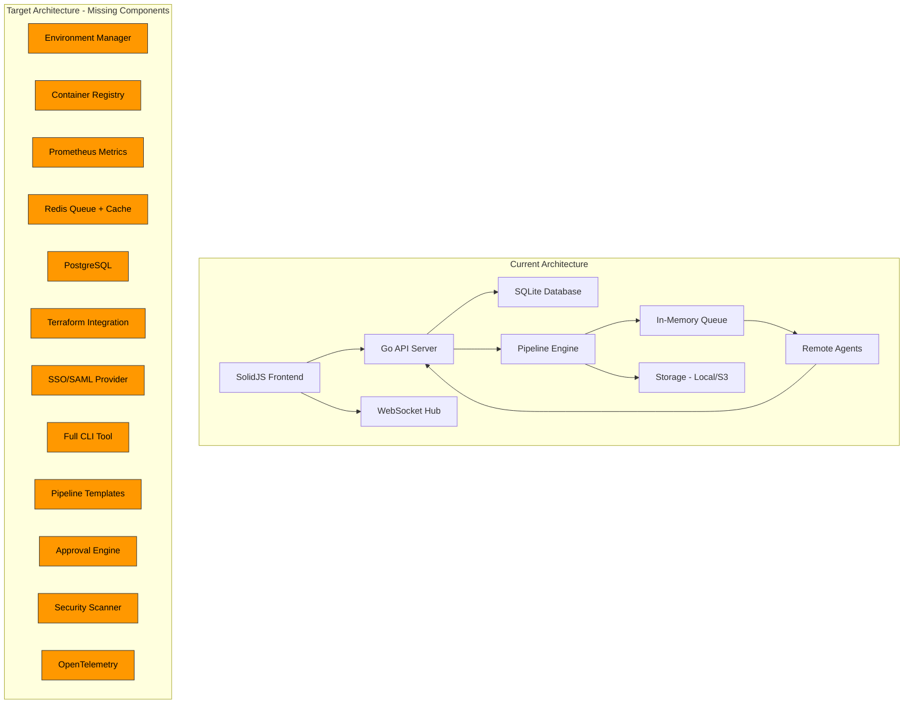

# FlowForge — Missing Features & Enhancement Analysis

> A comprehensive gap analysis comparing the current FlowForge implementation against what a modern, professional, enterprise-grade deploy manager should provide.

---

## Current Feature Inventory

| Area | What Exists |
|------|-------------|
| **Auth** | JWT login/register, refresh tokens, TOTP 2FA, OAuth (GitHub, GitLab, Google), RBAC (owner/admin/developer/viewer) |
| **Projects** | CRUD, org scoping, visibility settings, slug-based routing |
| **Repositories** | GitHub/GitLab/Bitbucket/git/local/upload providers, webhook integration, sync |
| **Pipelines** | YAML DSL, versioned configs, stages/jobs/steps, matrix builds, conditional execution, manual triggers with inputs |
| **Execution** | Local/Docker/Kubernetes executors, priority queue, scheduler, streaming logs, action system (checkout, artifacts, docker-build, helm-deploy) |
| **Agents** | Registration, heartbeat, pool management, label-based routing, load balancing, drain/remove |
| **Secrets** | AES-256-GCM encrypted, project-scoped, injection into pipeline env |
| **Environment Variables** | Project-level key-value pairs, bulk save |
| **Artifacts** | Upload/download, S3/local storage backends, expiry cleanup, SHA-256 checksums |
| **Notifications** | Slack, Email, Teams, Discord, PagerDuty, Webhook channels |
| **Monitoring** | Background workers (artifact expiry, agent health, log cleanup, metrics collector, stale run recovery) |
| **Import Wizard** | Multi-source import, language/framework auto-detection, pipeline generation |
| **Audit** | Audit log recording with actor, action, resource tracking |
| **WebSocket** | Real-time updates via hub/handler pattern |
| **Frontend** | SolidJS SPA with Dashboard, Projects, Pipelines, Runs, Agents, Settings, Admin pages |

---

## Missing Essential Features

### 1. Environments & Deployment Targets

**Gap:** No concept of deployment environments (dev, staging, production). The pipeline spec has an `environment` field on jobs but there's no environment management system.

**What's Needed:**
- [ ] Environment entity (name, URL, protection rules, required approvers)
- [ ] Environment-specific secrets and variables (override project-level)
- [ ] Deployment history per environment (which version is live where)
- [ ] Environment locks (prevent concurrent deploys to same env)
- [ ] Promotion flow — deploy to staging first, then promote to production
- [ ] Environment status dashboard — live view of what's deployed where
- [ ] Rollback capability — one-click revert to a previous deployment

### 2. Deployment Strategies

**Gap:** No deployment strategy abstractions. Current system just runs pipeline steps.

**What's Needed:**
- [ ] Rolling deployment support
- [ ] Blue/Green deployment strategy
- [ ] Canary deployment with configurable traffic split percentages
- [ ] Feature flag integration points
- [ ] Health check verification after deployment
- [ ] Automatic rollback on health check failure
- [ ] Deployment gates — require all checks to pass before proceeding

### 3. Application/Service Registry

**Gap:** Projects exist but there's no concept of the deployed application itself — its type, runtime, health endpoints, service dependencies.

**What's Needed:**
- [ ] Application type classification (web app, API, worker, cronjob, static site)
- [ ] Service dependency graph — which services depend on which
- [ ] Health check endpoint configuration per application
- [ ] Resource requirements (CPU, memory, replicas) per environment
- [ ] Application versioning tied to deployments (semver or git-based)
- [ ] Service catalog / inventory page in UI

### 4. Approval & Governance Workflows

**Gap:** The `approval_required` field exists in [`JobSpec`](backend/internal/pipeline/spec.go:87) and there's an [`ApproveRun`](backend/internal/api/router.go:97) endpoint, but the full workflow is skeletal.

**What's Needed:**
- [ ] Multi-approver support (require N of M approvers)
- [ ] Approval groups/teams
- [ ] Time-limited approval windows
- [ ] Approval audit trail with comments
- [ ] Auto-approve rules for certain environments/branches
- [ ] Slack/Teams integration for approval requests
- [ ] CODEOWNERS-style approval routing

### 5. Container Registry Management

**Gap:** The `docker-build-push` action exists in [`engine.go`](backend/internal/engine/engine.go:480) but there's no registry management.

**What's Needed:**
- [ ] Container registry credential management (Docker Hub, ECR, GCR, ACR, Harbor)
- [ ] Image scanning integration (Trivy, Snyk, Grype)
- [ ] Image tagging policies (semantic versioning, git SHA, branch-based)
- [ ] Image promotion between registries (dev → staging → prod)
- [ ] Built-in image listing and cleanup (garbage collection of old tags)

### 6. Infrastructure Provisioning

**Gap:** FlowForge deploys to pre-existing infrastructure but has no provisioning capability.

**What's Needed:**
- [ ] Terraform/OpenTofu integration for infrastructure-as-code
- [ ] Cloud provider connections (AWS, GCP, Azure)
- [ ] Cluster management (add/remove Kubernetes clusters)
- [ ] SSH key management for server-based deployments
- [ ] Cloud resource cost visibility
- [ ] Infrastructure drift detection

### 7. Advanced Pipeline Features

**Gap:** Pipeline system is solid but missing several enterprise features.

**What's Needed:**
- [ ] Pipeline templates / reusable workflow definitions
- [ ] Pipeline-as-Code from repo (auto-discover `flowforge.yml` on push)
- [ ] Parallel stage execution (current system is sequential stages)
- [ ] Dynamic pipelines — generate steps based on changed files (monorepo support)
- [ ] Pipeline composition — trigger downstream pipelines (fan-out/fan-in)
- [ ] Pipeline visualization improvements — real-time DAG with live status
- [ ] Pipeline marketplace — shareable, community pipeline templates
- [ ] Scheduled pipeline triggers (cron support is in the spec but implementation is missing)
- [ ] Branch protection rules integration

### 8. Observability & Monitoring

**Gap:** Basic metrics collection exists in [`worker.go`](backend/internal/worker/worker.go:182) but no actual observability stack.

**What's Needed:**
- [ ] Prometheus metrics endpoint (`/metrics`)
- [ ] Grafana dashboard templates
- [ ] OpenTelemetry trace propagation through pipeline execution
- [ ] Build time trends and analytics dashboard
- [ ] Flaky test detection from build logs
- [ ] Pipeline performance insights (bottleneck identification)
- [ ] Custom alerting rules (e.g., build time exceeded threshold)
- [ ] Log search/filtering with full-text indexing
- [ ] Deploy frequency, lead time, MTTR, change failure rate (DORA metrics)

### 9. Multi-Tenancy & Team Collaboration

**Gap:** Organizations exist but team-based access control within orgs is basic.

**What's Needed:**
- [ ] Teams within organizations (e.g., "Frontend Team", "Platform Team")
- [ ] Project-level role assignments (not just org-level)
- [ ] Fine-grained permissions (can deploy to prod, can edit pipelines, can manage secrets)
- [ ] SSO/SAML integration for enterprise identity providers
- [ ] SCIM provisioning for automated user lifecycle
- [ ] Session management (active sessions, force logout)
- [ ] IP allowlisting per organization
- [ ] API key management with scoped permissions (the [`apikey.go`](backend/internal/auth/apikey.go) exists but is basic)

### 10. CLI & Developer Experience

**Gap:** [`cmd/cli/main.go`](backend/cmd/cli/main.go) exists but is minimal (192 chars).

**What's Needed:**
- [ ] Full CLI tool: `flowforge deploy`, `flowforge run`, `flowforge logs`, `flowforge status`
- [ ] Local pipeline execution (`flowforge run --local`)
- [ ] Pipeline linting (`flowforge lint`)
- [ ] Secret management from CLI (`flowforge secret set/get/list`)
- [ ] CI/CD integration helpers (GitHub Actions, GitLab CI output)
- [ ] Interactive project setup wizard
- [ ] IDE extensions (VS Code plugin for pipeline YAML validation)
- [ ] GitOps mode — watch a repo and auto-deploy on changes

---

## Enhancement Priorities for Existing Features

### 11. Authentication & Security Enhancements

- [ ] Password policy enforcement (min length, complexity)
- [ ] Login attempt rate limiting and brute-force protection
- [ ] Refresh token rotation and revocation
- [ ] Device/session management in user settings
- [ ] Configurable token expiration per user role
- [ ] Security headers (CSP, HSTS) in production
- [ ] Vulnerability scanning for the platform itself (dependency audit)

### 12. Pipeline Run Experience

- [ ] Live log streaming with ANSI color support (terminal emulation in browser)
- [ ] Log download as file
- [ ] Step-level retry (re-run individual failed step, not entire pipeline)
- [ ] Run comparison (diff two runs to see what changed)
- [ ] Run annotations/comments (team can discuss a failed build inline)
- [ ] Build badges for README files (SVG status badges)
- [ ] Parameterized re-runs (change inputs when re-running)

### 13. Notification System Enhancements

- [ ] Per-pipeline notification rules (not just project-level)
- [ ] Notification preferences per user (opt-in/opt-out)
- [ ] In-app notification center with unread count
- [ ] Notification templates customization
- [ ] Rate limiting / deduplication for notification spam
- [ ] GitHub commit status checks / PR comments

### 14. Dashboard & Analytics

- [ ] Deployment frequency chart
- [ ] Mean time to recovery (MTTR) tracking
- [ ] Success/failure rate trends over time
- [ ] Cost per build/deployment (agent compute time)
- [ ] Team activity heatmap
- [ ] Customizable dashboard widgets
- [ ] Global search across projects, pipelines, runs, logs

### 15. Storage & Artifact Management

- [ ] Artifact retention policies (per project, configurable)
- [ ] Artifact dependencies between pipeline stages
- [ ] Build cache sharing across runs (Docker layer cache, npm cache)
- [ ] Large file support (chunked uploads)
- [ ] Artifact promotion (tag artifacts as "release-ready")
- [ ] GCS backend in addition to S3 and local

### 16. High Availability & Scaling

- [ ] Replace SQLite with PostgreSQL/MySQL for production (current: SQLite only)
- [ ] Redis-backed job queue (instead of in-memory)
- [ ] Horizontal server scaling with shared state
- [ ] Agent auto-scaling (spin up/down agents based on queue depth)
- [ ] Database connection pooling and read replicas
- [ ] Graceful zero-downtime server upgrades

---

## Architecture Diagram — Current vs. Target

---

## Recommended Priority Order

### Tier 1 — Core Gaps (Needed to be a real deploy manager)
1. **Environments & Deployment Targets** — without this, it's a CI tool, not a deploy manager
2. **Deployment Strategies** — rolling, blue/green, canary
3. **Container Registry Management** — deploy flow requires knowing what images to deploy
4. **Approval & Governance** — enterprise requirement for production deployments
5. **Scheduled Pipelines** — cron triggers are in the spec but not implemented

### Tier 2 — Enterprise Readiness
6. **PostgreSQL Support** — SQLite cannot scale
7. **SSO/SAML** — enterprise authentication requirement
8. **Pipeline Templates** — reduce duplication, enable platform teams
9. **DORA Metrics & Analytics** — prove deployment velocity improvements
10. **CLI Tool** — developer productivity

### Tier 3 — Competitive Differentiators
11. **Infrastructure Provisioning** — Terraform/cloud integration
12. **Security Scanning** — image and dependency scanning
13. **GitOps Mode** — repo-driven deployments
14. **Observability Stack** — Prometheus, OpenTelemetry
15. **Agent Auto-Scaling** — elastic compute

### Tier 4 — Polish & Scale
16. **In-App Notifications** — notification center
17. **Advanced Pipeline DAG** — parallel stages, fan-out/fan-in
18. **Build Caching** — faster builds
19. **HA/Horizontal Scaling** — Redis queue, multi-server
20. **IDE Extensions** — VS Code integration
